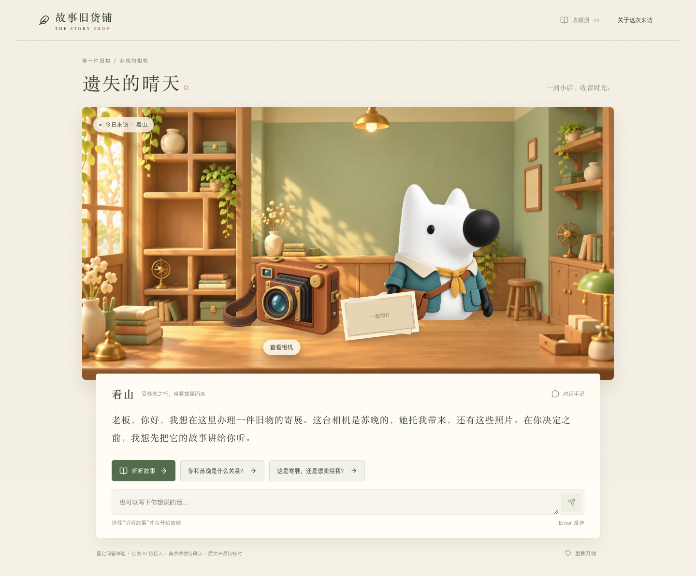
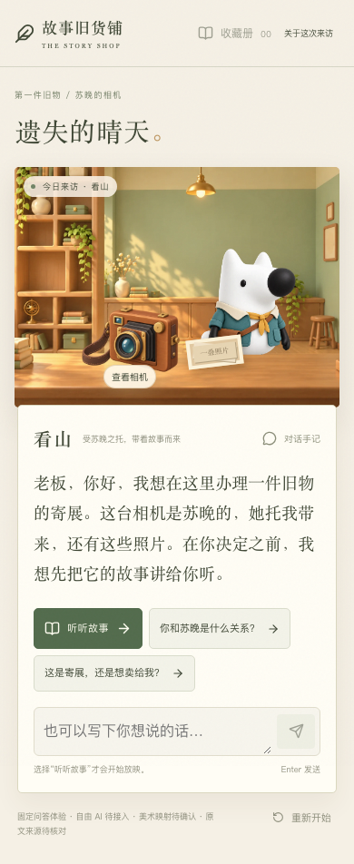
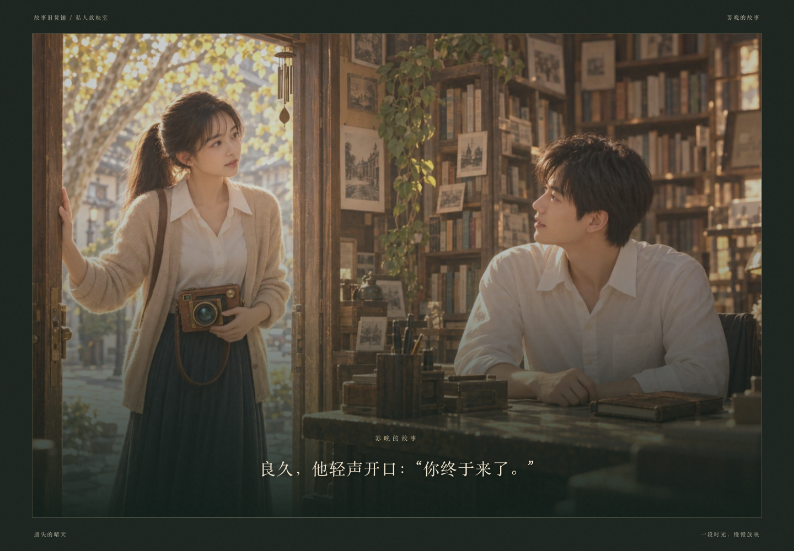
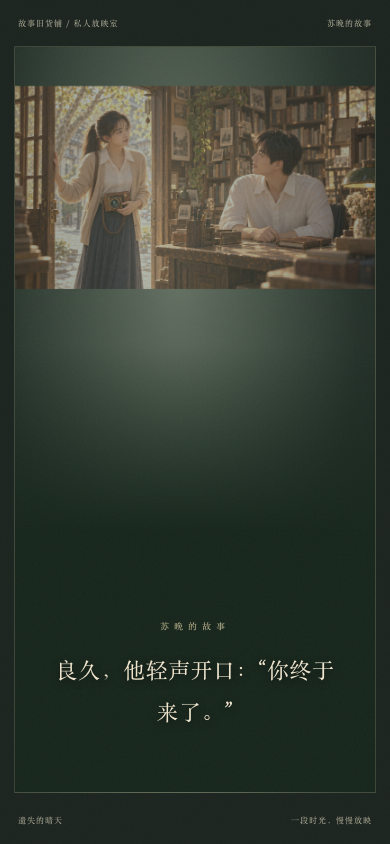

# 王泽轩｜连续放映前端交接

2026-09-15。对接基线为主分支 `f3c840c` 中的 [正式联调契约 v1](integration-contract.md)，正式章节为 `lost-sunshine / screening-v4.1`。本轮已实现素材接入、连续播放器、放映前后交流、寄展确认、收藏与恢复，并通过本地真实 FastAPI + SQLite 联调。**真实 AI、最终美术审定、原文核对和公网部署仍待各负责人完成。**

## 直接体验

在仓库根目录安装 `uv sync --locked`，前端安装 `cd frontend && npm ci`。之后在 `frontend/` 运行：

```bash
npm run dev:screening
```

打开 `http://127.0.0.1:5180`。命令同时启动回环地址后端 `18001` 和前端 `5180`，使用正式章节固定问答 `AI_MODE=scripted`，无需模型 Key。数据库默认 `data/frontend-screening.sqlite3`，与旧 demo 隔离；Ctrl+C 停止这组前后端进程，保存的数据保留。

可用 `STORY_API_PORT`、`STORY_WEB_PORT` 和 `STORY_LOCAL_DATABASE` 覆盖端口及开发数据库；不要指向正式生产库。`npm run dev` 仍保留旧探索 mock，不能用它判断新版放映是否接通。

## 本轮完成的交互

- 开场读取 `/health`、`/api/story` 和匿名会话，页面如实显示固定问答/AI 模式与素材、原文状态。
- 柜台使用独立背景、看山、相机和照片层。看山采用同一旅行服立绘，避免把不同服装当作表情切换。检查点从元数据读取；放映前不会提前展开带剧透的照片。
- 提供“听听故事”及脚本规定的两个开场提问。自由输入只发送 chat，不因关键词自动开始放映。
- 预加载网页图片后再提交 start。固定字幕完全取自当前 `/api/screening`，不在前端包中嵌入完整故事正文；每段实际展示满服务端时长后才提交 progress。等待确认及下一段加载时保留当前画面。
- 正常放映中没有输入、检查、暂停、跳过、翻页、拖动或返回按钮。只有异常/中断后才显示恢复界面；切到后台会停止计时，恢复不补报离开期间的字幕。
- 所有写入串行执行，落盘保存 request_id、expected_version、action 和 session_id。响应丢失后原样重试；确认结果后，再 resume 未完成单元。不同版本或 run_id 的字幕不会进入播放器。
- 放映结束回到柜台交流。用户点击“谈谈寄展”后显示确认卡，区分苏晚、看山和本店；取消不写接口。确认成功才入架、告别，双击不会发出两个收藏请求。
- 收藏通过 GET collection 读回版本快照，完整显示 51 单元正文、所有权及游戏连接设定、来源核对状态；没有把用户猜测加入事实，也没有伪造作者链接。
- 处理限流 Retry-After、版本冲突、旧 run_id、会话失效和内容版本变化。限额失败不触发自动重试风暴；旧体验保留，只有用户确认重置后才清空。

## 美术接入与映射

[网页资源目录](../frontend/public/assets/sunny/) 中的 11 张 WebP 总计约 2.05 MiB。原始 25 个 PNG 保留不变。可运行 `npm run prepare:art` 从原图重建；需要 Playwright Chromium，第一次运行 `npx playwright install chromium --only-shell`。脚本只做网页尺寸/压缩与透明通道保留，不重绘内容。

[manifest.json](../frontend/public/assets/sunny/manifest.json) 记录源文件名、SHA-256、目标路径、大小和 `frontend-proposal` 状态；[screening-art.ts](../frontend/src/data/screening-art.ts) 是可审查的前端映射。

| 用途 | 已接入资源 | 说明 |
| --- | --- | --- |
| 店内 | shop / visitor / camera | 空店背景、旅行服看山、木质相机；柜台前景复用原背景遮挡 |
| FILM001–008 | camera | 原图没有回收站/通勤/冲洗的逐镜头素材，以相机意象承载原文，不新增事件 |
| FILM009–018 | street / school / note | 女孩照片与背面题字；13–14 展示题字 |
| FILM019–023 | reunion | 苏晚走入书店 |
| FILM024–025 | photo | 保留画面右侧少年局部的江边照片 |
| FILM026–035、041–047 | bookshop | 书店二人场景复用，不补具体病名或额外事件 |
| FILM036–040 | street | 女孩照片回顾 |
| FILM048–051 | sunset / ending | 江边及苏晚拍摄眼前少年的结尾 |

这是基于已逐张查看素材的前端呈现方案，尚未获得产品/美术的最终审定，不等于每个分镜都有专属成图。不同服装的看山、错误无人风景合成、提前包含故事结尾的放映合成图没有混入正常剧情。`neutral/thoughtful/warm` 的同服装表情仍需美术补齐，当前保持同一立绘。

映射只匹配上述章节 ID 与内容版本；新版本/未知章节使用中性纸面，避免误套旧故事图片。后端 `asset_id` 和 `Story.version` 本轮未改，未将前端提案写成后端已批准的素材。

## 验证记录

| 验证 | 结果与边界 |
| --- | --- |
| TypeScript + 生产构建 | 通过，生成 `frontend/dist/` |
| 前端单元/契约测试 | 12 项通过；覆盖新接口请求字段、显式确认、限流头、来源字段和版本限定映射 |
| 旧 mock 浏览器回归 | 桌面/手机共 8 项通过 |
| 旧 demo 真实 HTTP | 桌面/手机共 2 项通过 |
| 正式完整播放 | 桌面 1440×1000、手机模拟视口 390×844 各通过；51 段逐字检查、按原始 317 秒时间轴实际播放，单次含网络交互约 5.4 分钟 |
| 响应丢失与刷新 | 桌面/手机各通过；服务器已提交后丢弃响应，刷新后比对原请求 UUID/正文一致，再 resume，从 FILM002 恢复 |
| 限流与素材失败 | 桌面/手机各通过；注入 429 验证冷却，阻断一张图片验证 start 请求为 0，恢复图片后才开始 |
| 双标签页 | 桌面/手机各通过；新播放器 resume 后旧播放器停止，同步后显式恢复 |
| 后端既有回归 | 36 项通过；未修改后端业务代码 |
| 开发启动器 | 实际用备用端口启动，health/前端均成功；Ctrl+C 后两个端口均释放 |

正式测试代码：[formal.spec.ts](../frontend/tests-screening/formal.spec.ts)。完整播放用真实服务与原始时长；异常用例仅在浏览器侧注入断网、429 或图片失败，不能把它们称作供应商故障实测。手机为浏览器模拟视口，不是实体手机验收。

测试执行中发现并修正不同 Playwright 套件共用产物目录造成的报告文件相互覆盖：现按 legacy/http/screening 分目录输出，受影响用例重跑通过。完整正常流程通过后，恢复逻辑与画面调整进行了对应专项复测。

复现正式浏览器验收：启动 `npm run dev:screening` 后，在另一个 `frontend/` 终端运行 `npm run test:screening`。测试会创建多个匿名会话；密集重复执行可能触发默认每小时 10 次创建限额，使用隔离测试库并按需提高测试进程的 `SESSION_CREATES_PER_HOUR`，不要修改线上限额。测试输出位于 `frontend/test-results/screening/`，截图默认在 `frontend/test-results/screening-evidence/`，可用 `FRONTEND_EVIDENCE_DIR` 指定。

### 界面证据

| 桌面柜台 | 手机柜台 |
| --- | --- |
|  |  |

| 桌面放映 | 手机放映 |
| --- | --- |
|  |  |

## 后端接手与剩余事项

刘文浩可按上述命令复测前端；生产构建使用 `VITE_TRANSPORT=http`、`VITE_API_BASE_URL=https://gushi.zexuan-604.com`，然后 `npm run build`。Base URL 不带 `/api`；后端允许精确 CORS origin，同域代理原路径 `/api/*` 与 `/health`。服务器、DNS 与登录交接仍见 [部署资源文档](infrastructure-handoff.md)。本轮没有部署公网应用或改变 DNS。

正式环境配置 `STORY_PATH=/app/stories/lost-sunshine.json`；真实 provider 未接入时使用 scripted 并保留页面标识。宋浩然与刘文浩仍需提供真实 AI、供应商超时/费用配置与语义验收。前端已留出 15 秒请求等待、错误与重试处理。

程荣涛/产品需审定上表镜头、补齐缺少的镜头和同服装表情；陈家庆需补齐原文 txt、来源与授权。当前 `original_verified=false` 继续如实展示，收藏按 51 个单元完整保存。新增素材或调整时间轴时，双方同步内容版本与映射后再验收。
