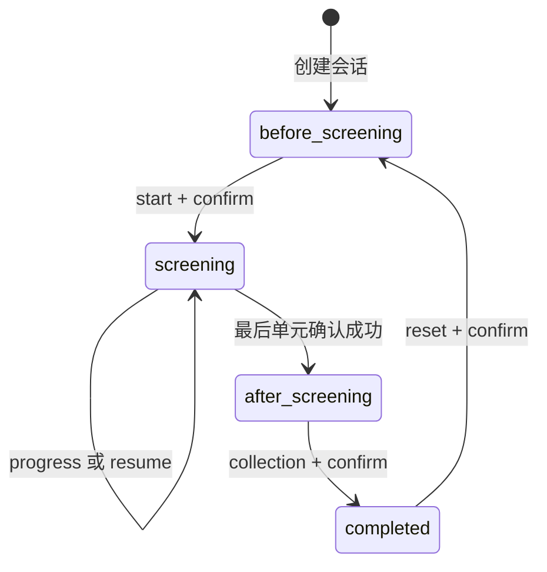

# 《故事旧货铺》正式章节联调契约 v1

日期：2026-09-14。适用章节：《遗失的晴天》`lost-sunshine / screening-v4.1`；API 版本：`0.2.0`。

本文按已合并提交 `b86dae2f500677d5cc702222ef96e55f9d10f304` 的实现编写，供前端、AI 与后端对照接入。**这是实现契约及待验收清单，不代表各方已签收，也不代表已上线。** 字段结构见同目录 [OpenAPI 快照](contracts/openapi.json)，运行服务的 `/openapi.json` 用于核对实际部署版本。阶段和重试等业务限制以本文补充，不能仅凭 Schema 判断操作是否允许。

## 1. 交付边界

| 负责人 | 交付内容 | 验收依据 |
| --- | --- | --- |
| 刘文浩 | 章节配置、状态推进、保存恢复、幂等、收藏、AI 调用入口及运行保障 | 本文 API、错误处理及验收用例 |
| 王泽轩 | 连续播放器、确认卡、会话保存、刷新恢复、错误提示；配合部署 | 浏览器完整走通正式章节，刷新不误推进 |
| 程荣涛、王泽轩 | 最终背景、人物、物件、分镜素材及映射 | 电脑和手机显示正确，字幕与图片对应 |
| 宋浩然、刘文浩 | 真实 AI 适配器、角色边界、自由问答与供应商配置 | 第 7 节协议及真实模型验收 |
| 刘文浩牵头、王泽轩配合 | 服务部署、模型配置、共享试玩入口 | HTTPS、持久化、备份恢复、前后端实机验收 |

现有后端具备正式章节流程和固定问答联调器；真实 AI、前端连续播放器、最终素材映射、共享部署仍待交付。原文 `.txt` 未找到，当前正文是仓库 v4 脚本的 51 个 FILM 单元，总时长 317 秒；不能称为已核实的原文 43 段。

## 2. 连接、认证与通用请求

- 本地 Base URL：`http://127.0.0.1:8000`。团队联调及正式 Base URL：**待部署后填写**。
- JSON 请求使用 `Content-Type: application/json`。受保护接口使用 `Authorization: Bearer <token>`，不用 Cookie；`session_id` 不能代替 token。
- `POST /api/sessions` 返回唯一一次可取得的原始 token。前端保存以恢复同一匿名会话，不写入 URL、日志、截图或问题报告。没有账户登录、跨设备找回或 token 找回接口。
- 除创建会话外，每个 POST 必填 `request_id`（UUID）和 `expected_version`（非负 JSON 整数，不接受字符串或布尔值）。新操作生成新 UUID，重试保持原路径及全部原字段。
- 请求模型拒绝未知字段，字符串去除首尾空白。`message` 为 1–2000 字符；`target_id`、`segment_id` 为 1–80 字符。请求体另受字节限制。
- 成功的游戏命令返回完整 `State`，新提交令 `version` 加 1。GET 不推进剧情版本，但认证访问会维护会话活跃时间。
- 响应有 `Cache-Control: no-store`、服务端生成的 `X-Request-ID`。此响应头用于排错，**与请求体幂等 UUID 不同**。错误体的 `trace_id` 与排错 ID 对应。
- CORS 使用部署时填写的具体前端 Origin，允许 GET、POST 及 Authorization、Content-Type；浏览器可读 X-Request-ID、Retry-After。不允许通配 Origin 配置。

## 3. HTTP 接口清单

表中“通用字段”指 `request_id`、`expected_version`；所有带认证的 POST 都包含它们。除创建返回 201，其余成功返回 200。

| 方法与路径 | 认证 | 请求额外字段 | 成功返回 |
| --- | --- | --- | --- |
| `GET /health` | 否 | 无 | 运行模式与数据库健康状态 |
| `GET /api/story` | 否 | 无 | 当前章节元数据 |
| `POST /api/sessions` | 否 | 无需请求体，无通用字段 | `{token, state}` |
| `GET /api/session` | 是 | 无 | `State` |
| `POST /api/inspect` | 是 | `target_id` | `State` |
| `POST /api/chat` | 是 | `message` | `State`，非流式 |
| `POST /api/screening/start` | 是 | `confirm: true` | `State` |
| `GET /api/screening` | 是 | 无 | `ScreeningView`，仅当前单元 |
| `POST /api/screening/progress` | 是 | `run_id`、`segment_id` | `State` |
| `POST /api/screening/resume` | 是 | 当前 `run_id` | `State`，签发新 run_id |
| `POST /api/collection` | 是 | 正式章节必须 `confirm: true` | `State` |
| `GET /api/collection` | 是 | 无 | 已保存的 `Collection` |
| `POST /api/reset` | 是 | `confirm: true` | 重置后的 `State` |
| `GET /api/pages/{page_id}` | 是 | 无 | 已解锁 `Page` |
| `POST /api/pages/{page_id}/read` | 是 | 仅通用字段 | `State` |

`pages` 两接口保留给探索 demo；当前正式章节没有故事页，不用它们替代放映。检查点从元数据读取，正式配置为 `camera_front`、`photo_stack`，不要沿用 demo 的 `photo_back`。

`/health` 返回 `status: "ok"`、`ai_mode: "mock" | "scripted" | "custom"`、`is_test_fixture: boolean`、`flow: "exploration" | "screening"`、`original_verified: boolean`。健康成功仅证明当前数据库探针成功，不证明供应商可用或模型回答合格。

`/api/story` 返回字符串 `id/version/title/item_name/owner/custodian/recipient`、布尔 `is_test_fixture`、`flow`、`source`、`inspection_targets: [{id, label}]`。这里的 `version` 是**内容版本字符串**，不是 State 的整数版本。这两个公共 GET 当前未声明完整响应模型，OpenAPI 的成功 Schema 为空；字段以本段和实际实现为准。

## 4. 返回结构

### State

| 字段 | 类型 | 语义 |
| --- | --- | --- |
| `session_id` | string | 会话标识，不是认证凭据 |
| `story_id`, `story_version` | string | 会话所属章节及内容版本 |
| `is_test_fixture` | boolean | 是否测试剧情；不表示已接真实 AI |
| `version` | integer | 当前会话提交版本，重置也继续递增 |
| `status` | `active` / `completed` | 是否已接收寄展 |
| `phase` | `exploration` / `before_screening` / `screening` / `after_screening` / `completed` | UI 使用此字段区分阶段 |
| `playback` | Playback / null | 放映开始前为 null |
| `clues` | `[{id, text, source: "inspection"}]` | 已检查线索 |
| `disclosed_facts` | string[] | 已披露事实 ID，不能由前端直接写入 |
| `unlocked_pages`, `read_pages` | string[] | 探索模式页 ID，正式章节为空 |
| `messages` | `[{role: "user"或"assistant", text}]` | 完整会话消息；无消息 ID、时间戳或流式增量 |
| `summary` | string | 服务端依据事实生成的摘要 |
| `expression` | `neutral` / `thoughtful` / `warm` | 当前角色表情 |
| `suggested_questions` | string[] | 建议问题，点击后走普通 chat |
| `can_collect` | boolean | 当前能否首次接收；不能代替明确确认 |
| `collection` | Collection / null | 接收后保存的内容快照 |

列表为空、字符串为空、可空字段为 null 都是有效情况。前端整体替换已接受的 State，不把 `messages` 全量结果重复追加到本地。

### Playback 与 ScreeningView

`Playback = {run_id: UUID, next_segment: integer, segment_started_at: number, completed: boolean}`。

- `next_segment` 从 **0** 开始，表示下一个尚未确认完成的单元；结束时等于 `total_segments`。
- `segment_started_at` 是服务端 Unix **秒**；字幕 `duration_ms` 是**毫秒**，不能混用。前端不得只按服务端时间差跳过实际展示。
- `run_id` 标识本次播放执行；resume 后换新，reset 后旧值失效。
- `ScreeningView = {story_id, story_version, version, phase, playback, segment, total_segments}`。
- `segment = {id: string, text: string, duration_ms: integer, visual: string, asset_id: string|null}`；时长范围 1–120000 毫秒，`visual` 是分镜说明，不是图片 URL。完成后 `segment=null`。

当前 `asset_id` 全为 null；没有放映前获取完整素材清单或静态素材托管 API。最终图片须由素材负责人交付映射和可访问地址，前端与后端共同确定加载方式；不能把 Collection 的 assets 当作开场预加载接口。

### Collection 与内容来源

Collection 的字符串字段为 `story_id/story_version/title/item_name/summary/owner/custodian/recipient/adaptation_note`，另有 `full_text: string[]`、`source`、`assets: [{id: string, path: string, status: "pending"|"approved"}]`。当前 assets 为空。

`source = {reference: string, author: string|null, original_url: string|null, text_format: "paragraphs"|"screening_units", original_verified: boolean, note: string}`。Schema 兼容两种格式，但当前正式配置使用 `screening_units`，并校验 full_text 与全部字幕逐项一致；`original_verified=false`，作者和原文链接未核实。

收藏是接收时保存的版本快照；更换当前章节配置后，原会话仍可 GET 收藏。reset 清空当前收藏与体验，**不是删除历史幂等记录或隐私数据的接口**；无独立永久收藏账户。

## 5. 正式章节状态与播放器



任何阶段都保留明确 reset 的后端恢复能力，图中省略其余重置箭头。产品正常放映界面不展示重置、聊天、检查、暂停、跳过、回退控件。

| 阶段 | 可执行的新操作 | 禁止或条件 |
| --- | --- | --- |
| before_screening | chat、inspect、start、reset | 不能提前收取、确认字幕或恢复放映 |
| screening | progress、resume；异常恢复时 reset | chat、inspect、collection 被拒绝，不排队 |
| after_screening | chat、inspect、collection、reset | 不能重启放映或继续报字幕进度 |
| completed | 读取状态和收藏、重复 collection、reset | 不能继续聊天；正式章节无可读故事页 |

正常流程：

1. 读取 `/health`、`/api/story`；使用保存的 token GET 会话，没有有效会话才创建。创建会话不支持幂等，不能无限自动重发。
2. 玩家选择“听听故事”后发送 start。自由输入、AI 回复或候选事件都不能替代此明确动作。
3. GET 当前字幕，加载素材并实际展示满 `duration_ms`，自动发送 progress。等待响应期间保持当前画面，服务端确认成功后才获取下一单元。
4. 每段按上述顺序推进。服务器以自身计时拒绝过早确认，但无法证明玩家实际观看；前端负责素材加载后的完整展示。317 秒是配置总时长，网络和加载会增加实际耗时。
5. 最后一个单元确认成功，服务端才设置放映完成、披露配置事实并进入 after_screening；停留足够久不会自动完成。
6. 展示寄展确认卡，玩家确认才 POST collection。取消只关闭卡片；不请求 reset。返回 completed 后再展示入架和告别。

中途刷新：先 GET State，处理本地保存的未决写请求；如果仍在 screening，带最新版本和当前 run_id 发 resume。成功后同一未完成单元从头展示并重新计时。不要每次 GET 字幕都调用 resume；不要按浏览器关闭期间经过的时间补报字幕。

## 6. 幂等、竞争与错误处理

前端为每个会话串行发出写操作，发送前保存 `{会话身份, 路径, 完整请求体}`。请求超时不代表未提交；先原样重试，不能为了重试换 ID 或改 expected_version。服务器成功提交过的请求返回当时的完整 State，不再重复推进。

只有同一会话、响应版本不低于本地已接受版本时，才接受返回快照。切换会话后丢弃旧会话在途响应；reset 后也不能让旧响应回滚 UI。多标签页不能靠各自按钮状态防并发，最终由服务端版本校验裁决。

发生 VERSION_CONFLICT 时 GET 最新 State，重新判断动作是否仍有必要；确实需要重做时用**新 UUID 与新版本**发起新操作。不要篡改旧请求后复用旧 ID。内容版本不匹配时可查看已存状态和收藏；继续新版须由用户明确重置，不能自动抹掉进度。

错误体统一为：

```json
{"error":{"code":"VERSION_CONFLICT","message":"进度已更新，请重新读取后再操作","trace_id":"服务端排错标识"}}
```

| HTTP | code | 客户端处理 |
| --- | --- | --- |
| 400 / 422 | INVALID_REQUEST | 修复格式、长度或字段；更正后是新请求 |
| 401 | AUTH_REQUIRED / INVALID_SESSION | 检查 token；无效或过期时提示重新开始，不循环重试 |
| 403 | PAGE_LOCKED / SCREENING_NOT_STARTED | 刷新状态，按阶段开放操作 |
| 404 | TARGET_NOT_FOUND / COLLECTION_NOT_FOUND | 检查元数据或展示尚未收藏 |
| 409 | VERSION_CONFLICT | 读取最新状态，按上文重新决定 |
| 409 | IDEMPOTENCY_CONFLICT | 同 ID 用于不同内容，修复请求队列逻辑 |
| 409 | STORY_VERSION_CHANGED | 保留旧体验，明确确认重置后进入新版 |
| 409 | SESSION_COMPLETED / SCREENING_IN_PROGRESS / INVALID_PHASE / SCREENING_UNAVAILABLE | 恢复正确阶段 UI，不盲目重试 |
| 409 | SCREENING_RUN_CHANGED / SCREENING_OUT_OF_ORDER | 重新读取状态和当前字幕，废弃旧播放器任务 |
| 409 | SCREENING_TOO_EARLY | 保持展示，满足当前时长后可原样重试 |
| 409 | COLLECTION_LOCKED | 等待放映完成及条件满足 |
| 409 | TURN_LIMIT | 提示会话问答上限；用户确认后可重置 |
| 409 | SESSION_COMMAND_LIMIT | 提示操作记录上限，需新建会话；reset 不能清空该计数 |
| 413 | REQUEST_TOO_LARGE | 缩小请求，停止原样重试 |
| 422 | CONFIRMATION_REQUIRED | 通过独立寄展确认卡发送 true |
| 429 | RATE_LIMITED | 按 Retry-After 秒数等待，再重试原请求 |
| 429 | AI_BUSY | 保留输入与原请求，退避重试 |
| 429 | AI_DAILY_LIMIT | 提示本日调用额度耗尽，停止短周期自动重试 |
| 502 / 504 | AI_UNAVAILABLE / INVALID_AI_EVENT / AI_TIMEOUT | 剧情未提交；保留输入，有限重试原请求；持续失败报 trace_id |
| 503 | DATABASE_UNAVAILABLE | 退避并重试原请求，持续失败交后端排查 |
| 503 | STORAGE_QUOTA / SESSION_CAPACITY | 交管理员清理，避免重试风暴 |
| 500 | INTERNAL_ERROR | 记录 trace_id、读取状态；需要重试时保持原请求 |
| 按实际状态 | HTTP_ERROR | 路由或 HTTP 层错误，检查路径及方法 |

内部未知游戏操作另有 `404 OPERATION_NOT_FOUND`，当前公开路由不会正常产生它。仅 RATE_LIMITED 保证 Retry-After，AI_BUSY 和 AI_DAILY_LIMIT 不带该头。502/504 的失败生成尝试仍计入日预算；网络断开后原调用可能继续，供应商计费不能承诺恰好一次。

## 7. AI 模块契约

这是**进程内 Python 适配器协议**，不是已经部署的外部 HTTP AI 服务。宋浩然交付可信模块路径及零参数工厂；刘文浩配置 `AI_MODE=custom`、`AI_PROVIDER_FACTORY=模块路径:工厂名`。工厂返回以下对象，模块 import 时不得启动服务器：

```python
from app.models import AIOutput, State, Story

class Provider:
    async def generate(self, *, message: str, state: State, story: Story) -> AIOutput:
        ...
```

`message` 是当前用户输入，`state` 是当前已提交状态，`story` 是服务端筛选后的上下文投影。不得对投影运行完整配置引用校验，不得自行加载完整版故事绕过筛选。不得直接写数据库或修改剧情状态。

| 阶段 | 模型可见内容与权限 |
| --- | --- |
| 放映前 | 当前允许事实、已检查物件、身份边界、开场问答；无完整正文、隐藏放映事实、后续问答和收藏摘要 |
| 放映中 | 后端拒绝 chat，不调用模型 |
| 放映后 | 本版全部字幕、已披露事实、配置问答；原文未知事项仍保持未知 |
| 已接收 | 后端拒绝新 chat |

所有阶段传入的 story 都移除 screening 时间轴和 assets。角色为受苏晚委托办理寄展的看山；玩家是店老板。不得把看山写成书店男生，不编造病名、男生姓名、题字作者、相机丢失经过或后续生活；用户猜测不成为事实。

返回值示例（放映前）：

```json
{
  "reply": "我受苏晚委托，来办理这台相机和照片的寄展。",
  "expression": "neutral",
  "suggested_questions": ["这是谁的相机？"],
  "events": []
}
```

reply 长度 1–2000 字符；expression 仅 neutral/thoughtful/warm；建议问题最多 3 个、各 1–200 字符；events 最多 10 个，唯一允许结构为 `{type: "disclose_fact", fact_id: string}`。正式章节推荐始终返回空 events，不能用事件披露未放映事实，也没有 start、finish、collect、reset 等模型事件。探索 demo 的候选事实权限另由后端校验。

后端验证结构、事实权限和提交版本；适配器负责供应商调用及自然语言事实一致性、身份一致性、防提前剧透和建议问题检查。输入裁剪不等于自然语言回答质量证明。

默认整体生成超时 10 秒、单进程最多 4 个在途聊天；适配器须响应取消，供应商超时及内部重试应纳入整体时间。前端 HTTP 等待应留出服务端超时和网络余量。同进程同会话同 ID 合并生成，已提交重试不再生成；跨进程、进程崩溃和供应商端计费幂等没有保证。

真实 AI 交付时须补齐：模块及依赖锁定、工厂名、密钥环境变量名称（文档不填密钥）、供应商和模型标识、输入输出 token 上限、超时重试策略、错误映射、预算配置与验收记录。`scripted` 只支持配置问题精确匹配，不能作为自由问答验收。

## 8. 部署与默认限额

| 配置 | 默认值 / 范围 |
| --- | --- |
| MAX_REQUEST_BYTES | 16384 字节，POST 实际请求体上限 |
| REQUESTS_PER_MINUTE | 每 IP 的 /api/ 请求 120 次/分钟 |
| SESSION_CREATES_PER_HOUR | 每 IP 创建会话 10 次/小时 |
| CHATS_PER_MINUTE | 每 IP chat 请求 30 次/分钟 |
| MAX_SESSIONS | 数据库最多 1000 个会话 |
| SESSION_TTL_SECONDS | 闲置 2592000 秒（30 天）失效 |
| CLEANUP_INTERVAL_SECONDS | 启动及每 3600 秒清理过期数据 |
| MAX_COMMANDS_PER_SESSION | 每会话 1000 条成功命令记录，包含放映及重置 |
| MAX_DATABASE_BYTES | 536870912 字节，数据库及 WAL 文件软配额 |
| AI_DAILY_CALL_LIMIT | 全库 UTC 日生成尝试 200 次，含失败及脚本模式 |
| 问答轮数 | 当前体验累计 100 条用户消息，放映开始确认台词计入 1 条 |

限流按单进程统计，重试也受请求限流；部署代理须显式配置信任来源，否则玩家可能共用代理 IP 配额。日调用数不是金额上限，模型输出 token 与供应商预算另行控制。备份恢复会回退数据库内日计数，恢复后须核对实际供应商用量。

部署采用持久化 SQLite 的受控单实例方案，不能据此承诺多副本一致限流或无损故障切换。备份、恢复、清理、预检命令见 [后端运行保障](backend-operations.md) 与 [部署说明](deployment.md)。共享地址、前端 Origin、模型配置、备份目标与执行周期由部署时补齐；当前没有已验证的公网地址或真实模型连接。

## 9. 联调验收与变更规则

| 用例 | 通过标准 | 执行方 |
| --- | --- | --- |
| 章节与身份 | health 显示实际 AI 模式，元数据为正式章节，角色及原文状态如实展示 | 前端 + 后端 |
| 完整放映 | 51 单元顺序完整展示，最后确认前不能收取 | 前端 + 后端 |
| 过早、乱序、旧 run | 请求被拒绝，进度不前进；恢复后旧播放器失效 | 前端 + 后端 |
| 刷新与响应丢失 | 首先处理未决请求，再恢复未完成单元，不重复推进或跳段 | 前端 + 后端 |
| 双标签与迟到响应 | 旧版本不覆盖新状态，冲突后按最新阶段显示 | 前端 + 后端 |
| 独立寄展确认 | 聊天同意及取消卡片均不收取；确认后快照完整 | 前端 + 后端 |
| 重启、版本变化、重置 | 重启可恢复；换内容版本可读旧收藏；确认重置才清空体验 | 后端 + 前端 |
| 真实 AI | 自由改写提问、诱导剧透、角色混淆、未知病名均符合第 7 节 | 宋浩然 + 刘文浩 |
| 模型异常及限额 | 输入保留、状态不误提交、无自动重试风暴 | AI + 后端 + 前端 |
| 素材及上线 | 手机电脑展示对应，HTTPS 可共享，持久化及备份恢复实测 | 素材 + 前端 + 部署 |

后端此前已有 36 项自动化测试及真实 HTTP 正式放映验收通过记录；这不替代真实 AI、浏览器播放器、最终素材和上线验收。本次文档字段及快照以当前代码再次核对，未将待交付项列为通过。

接口字段、阶段规则或错误语义变更时，同步更新本文及 OpenAPI 快照；内容、时间轴、条件或素材引用变化必须提升 Story.version。正式接入不得用 demo 验收结果替代正式章节。未列入现有接口的 SSE、上传、素材托管、永久删除、账户体系和独立 AI HTTP 服务，需要另行确定契约后实现。

实现依据：[模型](../app/models.py)、[路由](../app/main.py)、[状态机](../app/service.py)、[AI 边界](../app/ai.py)、[章节配置](../stories/lost-sunshine.json)。流程背景见 [正式章节说明](formal-chapter.md)。
